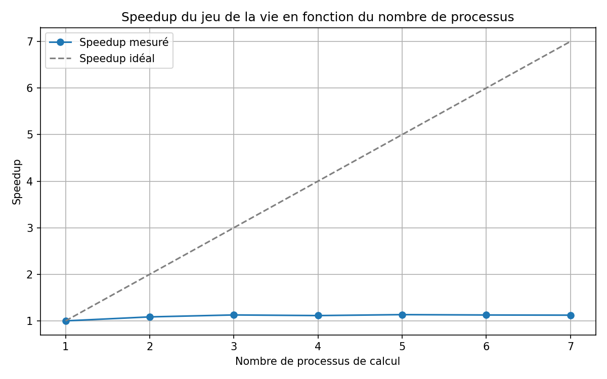
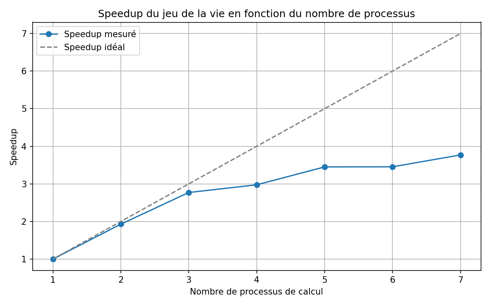
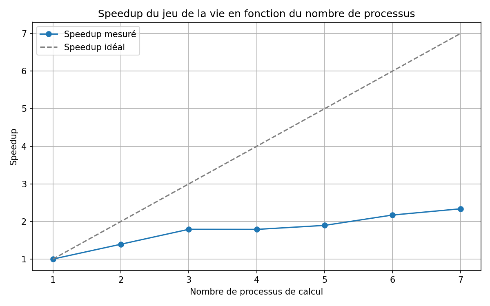

# Rapport projet jeu de la vie  — Maya Sakata, Coline Palefroy, Maelle Rouvray

Ce projet vise à implémenter le jeu de la vie de manière parallèle. Pour cela, nous sommes parties du fichier *game_of_life.py* qui correspond au code qui réalise ce jeu de manière séquentielle.

La parallélisation se fait avec MPI et la commande d'exécution des programmes est `mpiexec -n k python nom_fichier.py` en remplacant k par le nombre de processus souhaités.

## Parallélisation sur 2 processus  — *game_of_life_parallel.py*

Dans un premier temps, nous avons parallélise le fichier fourni sur 2 processus uniquement. Le processus 0 reçoit les modifications et s'occupe de mettre à jour localement la grille puis de l'afficher. Le processus 1 se charge de calculer la nouvelle génération et d'envoyer la liste des cellules modifiées au processus 0.
Le processus 0 s'occupe donc de l'affichage tandis que le processus 1 gère les calculs.

Pour 2 processus,

- le temps de calcul pour chaque itération est environ $4.9\times10^{-2}$ secondes.
- le temps d'affichage est environ $6.3\times10^{-3}$ secondes.

Le calcul étant le goulot d'étranglement, la parallélisation a du sens. Distribuer le calcul sur plusieurs processus va réduire le temps total.

## Parallélisation avec Split  — *game_of_life_split.py*

Nous avons parallélisé à l'aide de la fonction *Split* sur 2 processus comme précédemment. Le processus 1 calcule toujours la nouvelle génération et envoie les cellules modifiées au processus 0, qui les reçoit et réalise la mise à jour de la grille et son affichage.

La différence clé par rapport à la première parallélisation est l'utilisation de MPI.COMM_WORLD.Split() pour créer deux sous-communicateurs distincts : un pour le calcul (color = 1) et un pour l'affichage (color = 0). Cette séparation permet une meilleure organisation des communications et prépare le terrain pour la décomposition de domaine multi-processus.
Pour 2 processus,

- le temps de calcul pour chaque itération est environ $1.4\times10^{-2}$ secondes.
- le temps d'affichage est $2\times10^{-2}$ secondes.

On observe une réduction du temps de calcul par rapport à la première parallélisation, ce qui s'explique par une gestion plus efficace des communications grâce au Split.

## Parallélisation horizontale  — *game_of_life_domain_decomposition.py*

Nous avons découpé l'espace en bandes horizontales.

Chaque processus gère un bloc de lignes composé de 2 lignes de cellules fantômes (au dessus et en dessous) nécessaires aux calculs. Puis à chaque itération, les processus échangent les lignes de frontières. Chacun des processus se charge de calculer localement la génération suivante. Seul le processus 0 réalise l'affichage de la grille.
Voici les temps moyens pour chaque itération pour différents nombre de processus :

| Nombre de processus | 2 | 4 | 8 |
| --------------------- | --------- | ------ | ------- |
| Durée d'une itération | $2.4\times10^{-2}$ | $1.4\times10^{-2}$ | $1.4\times10^{-2}$ |
| Durée de l'affichage | $5.9\times10^{-3}$ | $6.5\times10^{-3}$ | $9\times10^{-3}$ |

On remarque que le temps diminue lorsque le nombre de processus augmente.

## Combinaison de split avec la décomposition de domaine  — *game_of_life_decomp_split.py*

Une fois le split et la décomposition de domaine maîtrisée, nous avons combiné les deux méthodes. On choisit de découper les processus de la manière suivante :

- le processus 0 affiche, écrit dans le terminal et récupère les données de temps -> color = 0
- les processus de 1 à nbp se chargent des calculs -> color = 1

Dans une première approche, un `time.sleep()` de durée fixe a été introduit au début de la boucle principale afin de cadencer les itérations et obtenir une animation fluide.

Cependant, cette méthode s'est révélée insuffisante pour deux raisons.

- `time.sleep()` n'est pas précis : le système d'exploitation ne garantit qu'une durée minimale de sommeil, le réveil réel pouvant varier de plusieurs millisecondes selon la charge du scheduler.
- Les processus de calcul et d'affichage appellent `time.sleep()` de manière indépendante. Leurs durées de sommeil dérivent l'une par rapport à l'autre, introduisant une attente variable à chaque itération.

Pour résoudre ce problème, on intègre la cadence directement dans le mécanisme de synchronisation MPI existant. À la fin de chaque itération, le processus d'affichage calcule le timestamp absolu `t1 + FRAME_DURATION`, où `t1` est l'horodatage du début de l'itération courante, et transmet ce timestamp au processus de calcul dans le message d'acquittement. Le processus de calcul, après réception, attend que ce moment soit atteint avant de repartir pour l'itération suivante.

Ainsi, la durée de chaque itération est ancrée sur une référence temporelle absolue commune aux deux processus : toute dérive accumulée lors d'une itération est automatiquement corrigée à la suivante, garantissant une vitesse d'animation constante et indépendante des aléas du système.

## Speedup en fonction du nombre de processus

### Pattern glider grille (100×90)

| nbp | Temps moy (s) | Speedup | Efficacité |
| ---- | ----------------- | ------- | ------ |
| 1 | 2.8813e-02 | 1.00 | 100.0% |
| 2 | 2.6552e-02 | 1.09 | 54.26% |
| 4 | 2.5877e-02 | 1.11 | 27.84% |
| 7 | 2.5670e-02 | 1.12 | 16.03% |

Sur une petite grille (100x90), le speedup est très limité dès le passage à 2 processus, avec une accélération de seulement 1.09 et une efficacité de 54.26%. Ensuite, les performances stagnent car avec 7 processus le speedup est seulement de 1.12.
Cela peut s'expliquer par la taille du domaine, à 8 processus, chaque processus ne traite qu'environ 12 lignes, rendant le surcoût des communications MPI (ghost cells, Gatherv) disproportionné par rapport au calcul effectif.

### Pattern glider_gun (grille 400×400)

| nbp | Temps moy (s) | Speedup | Efficacité |
| ---- | ----------------- | ------- | ------ |
| 1 | 1.2495e-01 | 1 | 100.0% |
| 2 | 6.4776e-02 | 1.93 | 96.45% |
| 4 | 4.2000e-02 | 2.98 | 74.38% |
| 7 | 3.3147e-02 | 3.77 | 53.85% |

Sur une grille plus grande (400×400), les résultats sont nettement meilleurs. Le speedup reste quasi idéal jusqu'à 2 processus (1.93), avec une efficaceté de 96.45%. Bien que l'accélération décroche progressivement ensuite, elle atteint quand même 3.77 qui est une bien meilleure performance qu'avec la petite grille. 
Ce comportement est conforme à la loi d'Amdahl : la portion non parallélisable du programme (communications MPI, Gatherv, affichage) fixe une limite haute au speedup atteignable, quelle que soit la taille du problème. Néanmoins, avec une grille plus grande, chaque processus dispose de suffisamment de travail pour amortir le coût des communications, ce qui explique le meilleur comportement général par rapport au glider.

On peut voir une nette amélioration du speedup lorsque l'on compare avec la version de décomposition de domaine sans le split.

## Conclusion

Ce projet nous a permis d'explorer différentes stratégies de parallélisation du jeu de la vie avec MPI. Nous sommes parties d'une implémentation séquentielle pour aboutir à une solution combinant décomposition de domaine et Split, offrant de bonnes performances sur des grilles de taille suffisante.

Les résultats montrent que l'efficacité de la parallélisation dépend fortement du rapport entre la taille du problème et le nombre de processus. Sur de petites grilles, le surcoût des communications MPI domine rapidement et annule le bénéfice de l'ajout de processus. Sur de grandes grilles en revanche, le speedup reste significatif jusqu'à 5-6 processus avant de saturer, conformément aux prédictions de la loi d'Amdahl.
